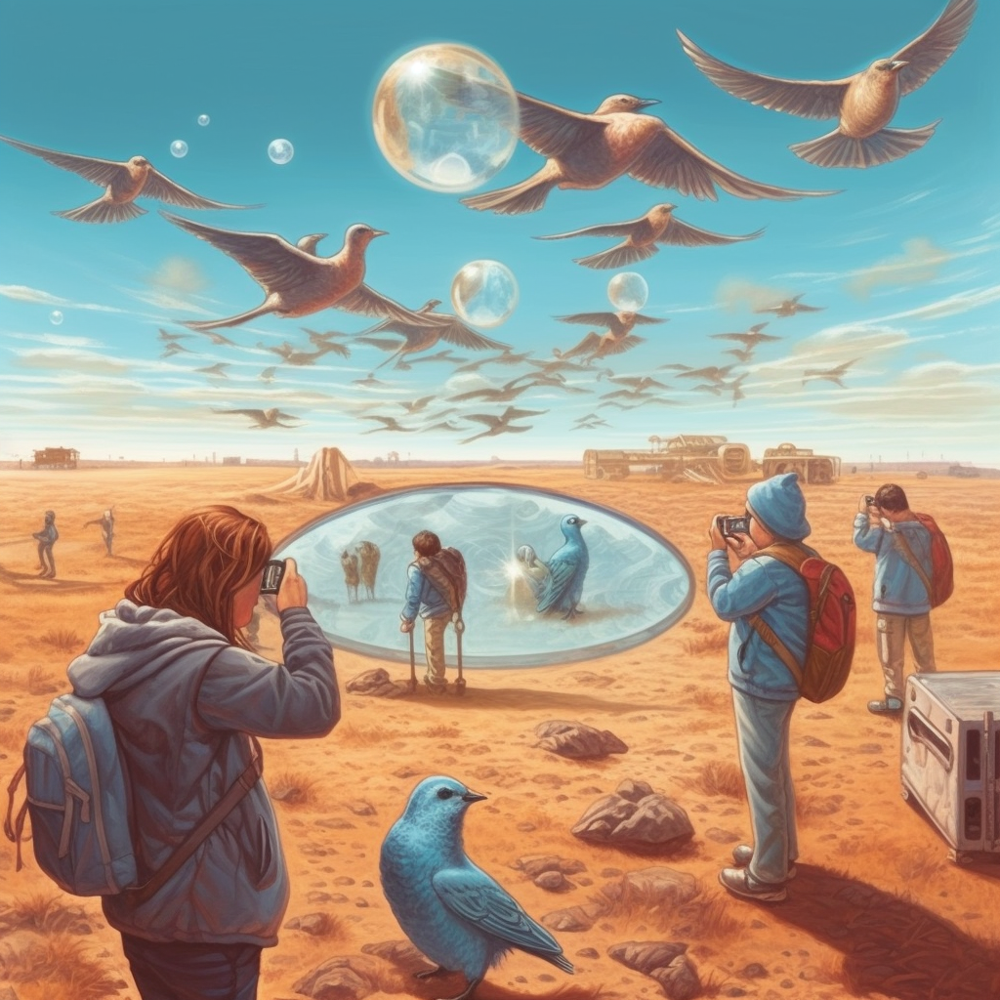

 

  
  <h3 align="center">DIVE</h3>
  

Decentralized mechanism for verifying ownership of Twitter profiles onchain.
  

<a href="https://lennardevertz.github.io/ethGlobalParis2023/">Live Version</a>
<a href="https://www.loom.com/share/2efbc917e87f45b8b584f96047672597">Video Demo</a>

## Example

- Users attest to ownership of their Twitter profile by posting a predefined tweet
- UMA's optimistic oracle verifies the existence of the tweet
- Verified connection is mapped onchain in a smart contract registry 
- The registry is a public good allowing anyone to write and read entries in a permissionless way
- Applicable to other web2 identifiers

## Challenges
- The size of the bond that needs to be posted to the UMA oracle might be prohibitevely high for the users. A potential solution to this problem could be using [Union Finance](https://union.finance/) to give vouches (borrowing power) to users who pass certain verification criteria.
- The dispute window (liveness) can be as long as a few hours, therefore significantly worsening the user experience. 

## Tech Stack

- [UMA Protocol](https://uma.xyz/)
- [Metamask SDK](https://metamask.io/sdk/)
- Smart Contracts

| Network   |      Contract      |       Address |
|----------|:-------------:|:------:|
| Goerli | [Oracle](https://goerli.etherscan.io/address/0xA19ea0042E9D39DD530439dDAA9028240E29c267) | 0xA19ea0042E9D39DD530439dDAA9028240E29c267 |
| Goerli | [Registry](https://goerli.etherscan.io/address/0xbF7561af8aba340fCbbc51cf4652DFb1845804DE) | 0xbF7561af8aba340fCbbc51cf4652DFb1845804DE |
| Gnosis | [Registry](https://gnosisscan.io/address/0xb0eaed426dfb2aeeff37ec251aaa52af2ce525f8) | 0xB0eAED426dFb2aEEFF37ec251aAA52aF2ce525F8 |
| Gnosis | [Oracle](https://gnosisscan.io/address/0x6a32501612b3c954cb0f97ba61e0440f81dbf8da) | 0x6A32501612B3C954cb0f97BA61E0440F81Dbf8da |
- Hardhat
- Truffle Dashboard
- [IDriss](https://www.idriss.xyz/)

The background image used in the logo was generated with the [Midjourney](https://www.midjourney.com/) text-to-image AI model. Prompt: a group of people using magnifying lenses and telescopes to watch a flight of a single Twitter bird --v 5.1

